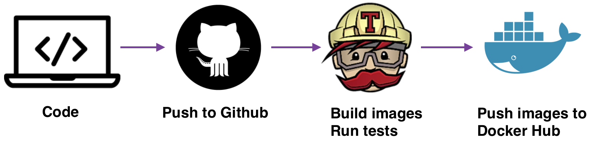

# Spring Boot 2 Example Project
This is a sample Java / Gradle / Spring Boot (version 2.0.4) application. 

Spring Boot makes it easy to create Spring-powered, production-grade applications and services with absolute minimum 
fuss. It takes an opinionated view of the Spring platform so that new and existing users can quickly get to the bits 
they need. You can use Spring Boot to create stand-alone Java applications that can be started using java -jar or more 
traditional WAR deployments.

# How to Run

This application is packaged as a jar which has Tomcat 8.5 embedded. No Tomcat, Jetty or JBoss installation is necessary.
You run it using the java -jar command.

* Clone this repository
* Make sure you are using JDK 1.8 and PostgreSQL started on port 5432
* You can build the project running ./gradlew clean build
* Once successfully built, you can run the service by 

<pre>
    java -jar /webservice/build/libs/webservice-0.0.1-SNAPSHOT.jar
</pre>

Once the application runs you should see something like this

<pre>
    2018-09-01 12:51:59.725  INFO 14803 --- [main] o.s.b.w.embedded.tomcat.TomcatWebServer  : Tomcat started on port(s): 8080 (http) with context path ''
    2018-09-01 12:51:59.728  INFO 14803 --- [main] m.s.w.c.core.SpringBoot2Application      : Started SpringBoot2Application in 5.36 seconds (JVM running for 5.876)
</pre>

You can also use Docker for running application. 

Download Docker. If you are on Mac or Windows, Docker Compose will be automatically installed. On Linux, make sure you 
have the latest version of Compose. If you're using Docker for Windows on Windows 10 pro or later, you must also switch 
to Linux containers.

Run in this directory:

<pre>
    docker-compose up
</pre>

Then you can see:

<pre>
    Starting springboot2_db_1 ... done
    Starting springboot2_spring_boot_1 ... done
    Attaching to springboot2_db_1, springboot2_spring_boot_1
    ...
</pre>

Here is the docker-compose.yml that powers the whole setup.

<pre>
    version: '2'
    services:
    # POSTGRES
        db:
            image: postgres:latest
            restart: always
            environment:
                POSTGRES_PASSWORD: postgres
    # SPRING_BOOT APPLICATION
        spring_boot:
            image: vadimeladii7/springboot2:latest
            ports:
                - "8080:8080"
            links:
                - db
            depends_on:
                - db
            environment:
                - SPRING_DATASOURCE_URL=jdbc:postgresql://db:5432/postgres
                - SPRING_DATASOURCE_USERNAME=postgres
                - SPRING_DATASOURCE_PASSWORD=postgres
                - SPRING_FLYWAY_URL=jdbc:postgresql://db:5432/postgres
                - SPRING_FLYWAY_USER=postgres
                - SPRING_FLYWAY_PASSWORD=postgres
</pre>

# Docker Workflow

The flow is summarized as follows:

* Code on local machine
* Push commits to Github (branch master)
* Travis is notified and builds new a new Docker image and runs tests against the newly-built image
* If all work well, Travis pushes the new image to Docker Hub (with tag latest)

This is the .travis.yml file: 

<pre>
    sudo:
      required
    
    services:
      - docker
    
    language: java
    
    jdk:
      - oraclejdk8
    
    install: gradle -p webservice assemble
    
    os:
      - linux
    
    env:
      global:
        - COMMIT=${TRAVIS_COMMIT::7}
    
    branches:
      only:
        - master
    
    after_success:
    
       #LOGIN
      - docker login -u $D_USER -p $D_PASS
    
       #TAG
      - export TAG=`if [ "$TRAVIS_BRANCH" == "master" ]; then echo "latest"; else echo $TRAVIS_BRANCH ; fi`
    
       #DATAWAREHOUSE
      - export SPRINGBOOT=vadimeladii7/springboot2
      - docker build -t $SPRINGBOOT:$COMMIT ./webservice
      - docker tag $SPRINGBOOT:$COMMIT $SPRINGBOOT:$TAG
      - docker push $SPRINGBOOT
</pre>

# About the Service

The service is just a simple student-address REST service. It uses a relational database PostgreSQL to store the data.
If your database connection properties work, you can call some REST endpoints defined in md.springboot.webservice.AddressController,
md.springboot.webservice.StudentController on port 8080.

Here is what this little application demonstrates:

* Full integration with the latest Spring Framework: inversion of control, dependency injection, etc
* Packaging as a single jar with embedded container (tomcat 8.5): No need to install a container separately on the host just run using the java -jar command
* Writing a RESTful service using annotation: supports both XML and JSON request / response; simply use desired Accept header in your request
* Exception mapping from application exceptions to the right HTTP response with exception details in the body
* Spring Data Integration with JPA/Hibernate with just a few lines of configuration and familiar annotations
* Automatic CRUD functionality against the data source using Spring Repository pattern
* Spring Security for access endpoint with token by role
* All APIs are "self-documented" by Swagger2 using annotations

Here are some endpoints you can call:

#### Retrieve a paginated list of address

<pre>
    http://localhost:8080/api/address?page=0&size=10
    
    Response: HTTP 200
    CONTENT: paginated list 
</pre>

#### Retrieve an address by ID

<pre>
    http://localhost:8080/api/address/{id}
    
    Response: HTTP 200
    CONTENT: 

    {
      "id": "integer"
      "street": "string",
      "city": "string",
      "state": "string",
      "zipcode": "string"
    }

</pre>

#### Create a address resource

<pre>
    POST /api/address
    Accept: application/json
    Content-Type: application/json
    
    {
      "street": "string",
      "city": "string",
      "state": "string",
      "zipcode": "string"
    }
    
    RESPONSE: HTTP 201 (Created)
    CONTENT:  
       
    {
      "id": "integer"
      "street": "string",
      "city": "string",
      "state": "string",
      "zipcode": "string"
    }
    
    Location header: http://localhost:8080/api/address
</pre>

#### Update a hotel resource

<pre>
    PUT /api/address/1
    Accept: application/json
    Content-Type: application/json
    
    {
      "id": "integer"
      "street": "string",
      "city": "string",
      "state": "string",
      "zipcode": "string"
    }
    
    RESPONSE: HTTP 200 (OK)
    CONTENT:  
       
    {
      "id": "integer"
      "street": "string",
      "city": "string",
      "state": "string",
      "zipcode": "string"
    }
</pre>

Creating also CRUD Endpoints for Student

#### To view Swagger 2 API docs

Run the server and browse to localhost:8080/swagger-ui.html

